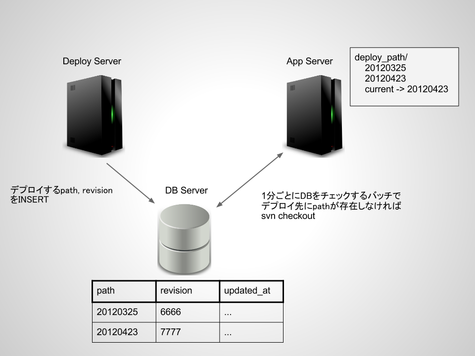
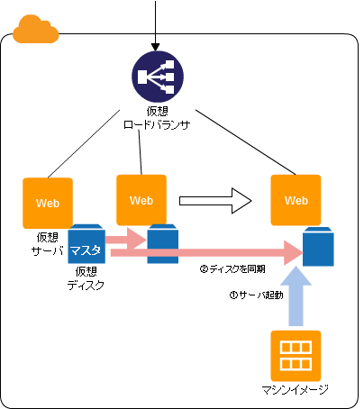
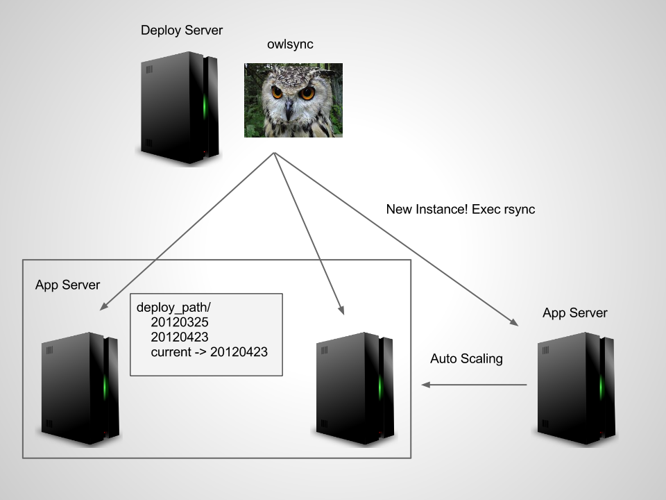

AWSでのデプロイの話
---

Terunori Togo (@terut)

デプロイといえば
---

Capistrano
---

多分に偏見が入っています

デプロイするには
---

deploy.rb書いて

    $ bundle exec cap production deploy

capistrano_extは使ってるよね、ね

簡単ですね
---

ある日
---

某PHPプロジェクト降臨

AWS使ってた
---

簡単ですね
---

僕等にはCapistranoあるし、PHPでの採用実績も 
色々あるっぽい

AWSは簡単じゃなかった
---

Auto Scaling
---

ELB（ロードバランサ）にぶらさがってるインスタンスの 
CPU使用率の平均が50%以上だったらインスタンス追加 
とかできる

Capistranoによるデプロイ
---

デプロイ先は固定であり、勝手に増殖するインスタンスの 
面倒は見れない

かくして僕の切り札は やぶれたやばい
---

先人の知恵
---

某PHPプロジェクトはよく考えられてた 

説明しよう
---

頭よい
---

僕にはセンスなんてなかったんやー

Batch散らばりすぎやばい
---

集約したいよね、ね
 
セイヤーッ！
---

http://aws.clouddesignpattern.org

クラウドデザインパターン
---

センスのない僕とー、AWSクラウドデザインパターンがー、 
出会ったー

Clone Server Pattern
---

俺たちのrsync
---

そうやrsyncやrsyncなんやー

NEW アプローチ
---

owlsync
---

仕組み
---

Deploy ServerにAuto Scalingであがってきたインスタンスを
監視するデーモンを立てて新しく立ち上がってきたらrsync

既に同期したものは同期しない

 
https://github.com/terut/owlsync

動作確認して本番投入
---

できませんでした
---

言い訳
---

* Twigがowner apacheではいて発狂
* cronの設定ファイルはowner rootじゃないと動かない発狂
* つまりdeploy用のユーザとrootとapacheが入り乱れて発狂 
* rsyncがsudoで動くように各サーバにrsync用のスクリプトを置く必要があって発狂
* owlsyncみたいなテストないgemは使うなってばあちゃんが言ってた
* 設計固まってなかったので試してみて成功したらテスト書くつもりだったけど言い訳
* テスト書きますすいません

先人の知恵は偉大
---

さっさと安定させたかったので、svnのデプロイを 
gitにリプレイスした

かっー、安定運用いいわー、かっー
---

Shibuya.rbでヒント得た
---

* user scriptで起動時にrsync
* s3syncを使って同期(できるのかしら)
* もっと良い方法あれば教えて

 
NFSは止まると処理がブロックされてアボーンするので やりたくない

AWSこわくない
---

AWSで楽しいデプロイライフを！

間違ってもrootでシステムを運用するんじゃないぞ！
